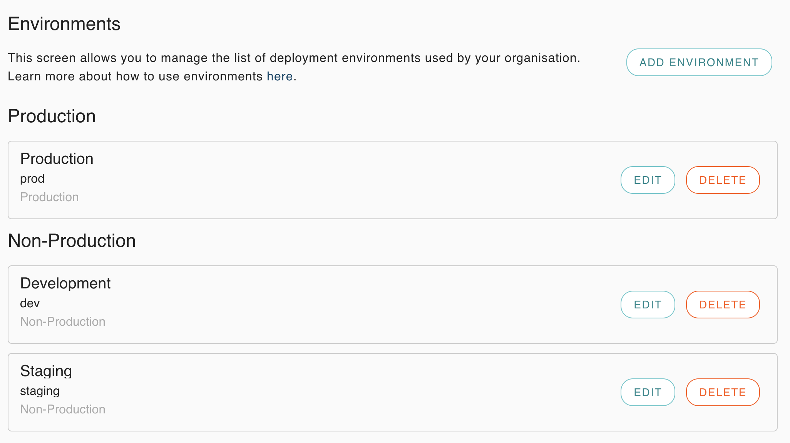
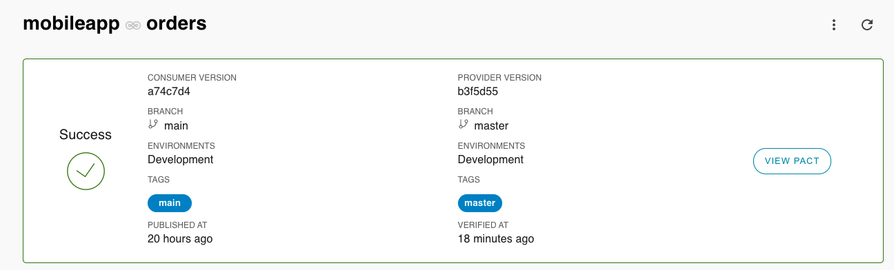
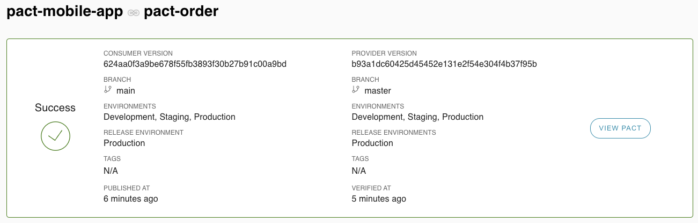

# PACT Consumer example
 

[](https://nathandeamer.pactflow.io/hal-browser/browser.html#https://nathandeamer.pactflow.io/pacticipants/pact-mobile-app/branches/main/latest-version/can-i-deploy/to-environment/dev)

[](https://nathandeamer.pactflow.io/hal-browser/browser.html#https://nathandeamer.pactflow.io/pacticipants/pact-mobile-app/branches/main/latest-version/can-i-deploy/to-environment/staging)

[](https://nathandeamer.pactflow.io/hal-browser/browser.html#https://nathandeamer.pactflow.io/pacticipants/pact-mobile-app/branches/main/latest-version/can-i-deploy/to-environment/prod)


### Setup:
1. Get (and set) your PACT environment variables by clicking 'Copy Env Vars' for [Read/write token (CI)](https://[user].pactflow.io/settings/api-tokens).  
(used in pact section of [build.gradle](build.gradle))
```
export PACT_BROKER_BASE_URL=https://[user].pactflow.io
export PACT_BROKER_TOKEN=NotMyRealBrokerToken
```
2. Create dev, staging and prod [environments](https://[user].pactflow.io/settings/environments) in pactflow

Remember to mark 'prod' as a Production environment when asked.
3. Download the standalone [pact-cli](https://github.com/pact-foundation/pact-ruby-standalone/releases) and add to your $PATH `export PATH=$HOME/bin/pact/bin:$PATH`
   or via [brew](https://github.com/pact-foundation/homebrew-pact-ruby-standalone)
## Best practices:
1. Consumer name should equal the repo name - This makes webhooks easier
2. Use the FULL git-sha (40 characters) for version numbers - for the github status check api
3. What does a good consumer test look like: https://docs.pact.io/consumer/contract_tests_not_functional_tests/


### Run the consumer tests:
1. `./gradlew clean test --tests "*ConsumerPactTest"`  
See generated contracts in [build/pacts](build/pacts)

### Publish the consumer tests to the broker
Choose one of the following options:
1. gradle: `./gradlew pactPublish`.  
This will publish the consumer pacts to pactflow with version: `<git sha>` and branch: `<branch name>` and tag: `<branch name>` (See pact section in [build.gradle](build.gradle))) 
2. pact-cli: `pact-broker publish build/pacts --consumer-app-version=$(git rev-parse HEAD) --branch=$(git rev-parse --abbrev-ref HEAD)`

### Can I deploy
Choose one of the following options:
1. gradle: At time of writing the pact gradle canIDeploy task does not support branches and environments.
2. pact-cli: ```pact-broker can-i-deploy --pacticipant=$(basename `git rev-parse --show-toplevel`) --version=$(git rev-parse HEAD) --branch=$(git rev-parse --abbrev-ref HEAD) --to-environment=dev```  
** Remember to replace the `--to-environment` with the environment you want to check if you can deploy too.

To get can-i-deploy to pass you'll need to follow the provider steps in [pact-order](https://github.com/nathandeamer/pact-order)

### Record a deployment
After `can-i-deploy` has passed and the service has been deployed to an environment we should [record a deployment](https://docs.pact.io/pact_broker/recording_deployments_and_releases)

Choose one of the following options:
1. gradle: At time of writing the pact gradle plugin does not support recording a deployment
2. pact-cli: ```pact-broker record-deployment --pacticipant=$(basename `git rev-parse --show-toplevel`) --version=$(git rev-parse HEAD) --environment=dev```



### Record a release
When a version has been deployed to production we should record a release.
1. gradle: At time of writing the pact gradle plugin does not support recording a release
2. pact-cli: ```pact-broker record-release --pacticipant=$(basename `git rev-parse --show-toplevel`) --version=$(git rev-parse HEAD) --environment=prod```


