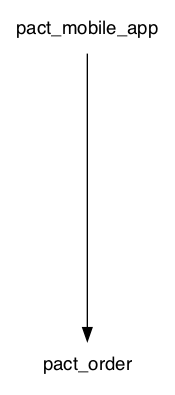

# PACT Consumer example

# TODO 
- Badges (Do you need to use `--tag-with-git-branch`?)
- Github webhooks (What permissions does your token need)

### Setup:
1. Get (and set) your PACT environment variables by clicking 'Copy Env Vars' for [Read/write token (CI)](https://[user].pactflow.io/settings/api-tokens).  
(used in pact section of [build.gradle](build.gradle))
```
export PACT_BROKER_BASE_URL=https://[user].pactflow.io
export PACT_BROKER_TOKEN=NotMyRealBrokerToken
```
2. Create dev, staging and prod [environments](https://[user].pactflow.io/settings/environments) in pactflow

Remember to mark 'prod' as a Production environment when asked.
3. Download the standalone [pact-cli](https://github.com/pact-foundation/pact-ruby-standalone/releases) and add to your $PATH `export PATH=$HOME/bin/pact/bin:$PATH`

### Run the consumer tests:
1. `./gradlew clean test --tests "*ConsumerPactTest"`  
See generated contracts in [build/pacts](build/pacts)

### Publish the consumer tests to the broker
Choose one of the following options:
1. gradle: `./gradlew pactPublish`  
This will publish the consumer pacts to pactflow with version: `<git sha>` and branch: `<branch name>` (See pact section in [build.gradle](build.gradle)))
2. pact-cli: `pact-broker publish build/pacts --consumer-app-version=$(git rev-parse HEAD) --branch=$(git rev-parse --abbrev-ref HEAD)`
3. docker: 
```
docker run --rm \
 -w ${PWD} \
 -v ${PWD}:${PWD} \
 -e PACT_BROKER_BASE_URL \
 -e PACT_BROKER_USERNAME \
 -e PACT_BROKER_PASSWORD \
  pactfoundation/pact-cli:latest \
  publish \
  ${PWD}/build/pacts \
  --consumer-app-version=$(git rev-parse HEAD) \
  --branch=$(git rev-parse --abbrev-ref HEAD)
```

### Can I deploy
Choose one of the following options:
1. gradle: At time of writing the pact gradle canIDeploy task does not support environments.

2. pact-cli: `pact-broker can-i-deploy --pacticipant=pact-mobile-app --version=$(git rev-parse HEAD) --branch=$(git rev-parse --abbrev-ref HEAD) --to-environment=dev`

3. docker: 
```
docker run --rm \
        -e PACT_BROKER_BASE_URL \
        -e PACT_BROKER_TOKEN \
        pactfoundation/pact-cli:latest \
        broker can-i-deploy \
        --pacticipant=pact-mobile-app \
        --version=$(git rev-parse HEAD) \
        --branch=$(git rev-parse --abbrev-ref HEAD) \
        --to-environment=dev
```
** Remember to replace the `--to-environment` with the environment you want to check if you can deploy too.

To get can-i-deploy to pass you'll need to follow the provider steps in [pact-order](https://github.com/nathandeamer/pact-order)

### Record a deployment
After `can-i-deploy` has passed and the service has been deployed to an environment we should [record a deployment](https://docs.pact.io/pact_broker/recording_deployments_and_releases)

Choose one of the following options:
1. gradle: At time of writing the pact gradle plugin does not support recording a deployment
2. pact-cli: `pact-broker record-deployment --pacticipant=pact-mobile-app --version=$(git rev-parse HEAD) --environment=dev`
3. docker: 
```
docker run --rm \
        -e PACT_BROKER_BASE_URL \
        -e PACT_BROKER_TOKEN \
        pactfoundation/pact-cli:latest \
        broker record_deployment \
        --pacticipant=pact-mobile-app \
        --version=$(git rev-parse HEAD) \
        --environment=dev
```


### Record a release
When a version has been deployed to production we should record a release.
1. gradle: At time of writing the pact gradle plugin does not support recording a deployment
2. pact-cli: `pact-broker record-release --pacticipant=pact-mobile-app --version=$(git rev-parse HEAD) --environment=prod`
3. docker:
```
docker run --rm \
        -e PACT_BROKER_BASE_URL \
        -e PACT_BROKER_TOKEN \
        pactfoundation/pact-cli:latest \
        broker record_release \
        --pacticipant=pact-mobile-app \
        --version=$(git rev-parse HEAD) \
        --environment=prod
```


## Generate network graph:

1. Install graphviz (`brew install graphviz`)

```
echo "digraph { ranksep=3; ratio=auto; overlap=false; node [  shape = plaintext, fontname = "Helvetica" ];" > latest.dot
curl -H 'Authorization: Bearer '"$PACT_BROKER_TOKEN"'' $PACT_BROKER_BASE_URL/pacts/latest | jq '.pacts[]._embedded | .consumer.name + "->" + .provider.name' | tr -d '"' |  sed 's/-/_/g' | sed 's/_>/->/g' >> latest.dot; echo "}" >> latest.dot
dot latest.dot -opact-network.png -Tpng
open pact-network.png
```



## Best practices:
1. Consumer name should equal the repo name (This makes webhooks easier)
2. Use the FULL git-sha (40 characters) for version numbers if you want to use the git status check api.