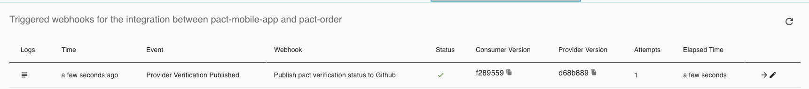

# PACT Consumer example

# TODO 
- Badges (Do you need to use `--tag-with-git-branch`?)
- Slack webhooks - make better template.

### Setup:
1. Get (and set) your PACT environment variables by clicking 'Copy Env Vars' for [Read/write token (CI)](https://[user].pactflow.io/settings/api-tokens).  
(used in pact section of [build.gradle](build.gradle))
```
export PACT_BROKER_BASE_URL=https://[user].pactflow.io
export PACT_BROKER_TOKEN=NotMyRealBrokerToken
```
2. Create dev, staging and prod [environments](https://[user].pactflow.io/settings/environments) in pactflow

Remember to mark 'prod' as a Production environment when asked.
3. Download the standalone [pact-cli](https://github.com/pact-foundation/pact-ruby-standalone/releases) and add to your $PATH `export PATH=$HOME/bin/pact/bin:$PATH`

## Best practices:
1. Consumer name should equal the repo name (This makes webhooks easier)
2. Use the FULL git-sha (40 characters) for version numbers if you want to use the git status check api.


### Run the consumer tests:
1. `./gradlew clean test --tests "*ConsumerPactTest"`  
See generated contracts in [build/pacts](build/pacts)

### Publish the consumer tests to the broker
Choose one of the following options:
1. gradle: `./gradlew pactPublish`  
This will publish the consumer pacts to pactflow with version: `<git sha>` and branch: `<branch name>` (See pact section in [build.gradle](build.gradle)))
2. pact-cli: `pact-broker publish build/pacts --consumer-app-version=$(git rev-parse HEAD) --branch=$(git rev-parse --abbrev-ref HEAD)`
3. docker: 
```
docker run --rm \
 -w ${PWD} \
 -v ${PWD}:${PWD} \
 -e PACT_BROKER_BASE_URL \
 -e PACT_BROKER_USERNAME \
 -e PACT_BROKER_PASSWORD \
  pactfoundation/pact-cli:latest \
  publish \
  ${PWD}/build/pacts \
  --consumer-app-version=$(git rev-parse HEAD) \
  --branch=$(git rev-parse --abbrev-ref HEAD)
```

### Can I deploy
Choose one of the following options:
1. gradle: At time of writing the pact gradle canIDeploy task does not support environments.

2. pact-cli: `pact-broker can-i-deploy --pacticipant=pact-mobile-app --version=$(git rev-parse HEAD) --branch=$(git rev-parse --abbrev-ref HEAD) --to-environment=dev`

3. docker: 
```
docker run --rm \
        -e PACT_BROKER_BASE_URL \
        -e PACT_BROKER_TOKEN \
        pactfoundation/pact-cli:latest \
        broker can-i-deploy \
        --pacticipant=pact-mobile-app \
        --version=$(git rev-parse HEAD) \
        --branch=$(git rev-parse --abbrev-ref HEAD) \
        --to-environment=dev
```
** Remember to replace the `--to-environment` with the environment you want to check if you can deploy too.

To get can-i-deploy to pass you'll need to follow the provider steps in [pact-order](https://github.com/nathandeamer/pact-order)

### Record a deployment
After `can-i-deploy` has passed and the service has been deployed to an environment we should [record a deployment](https://docs.pact.io/pact_broker/recording_deployments_and_releases)

Choose one of the following options:
1. gradle: At time of writing the pact gradle plugin does not support recording a deployment
2. pact-cli: `pact-broker record-deployment --pacticipant=pact-mobile-app --version=$(git rev-parse HEAD) --environment=dev`
3. docker: 
```
docker run --rm \
        -e PACT_BROKER_BASE_URL \
        -e PACT_BROKER_TOKEN \
        pactfoundation/pact-cli:latest \
        broker record_deployment \
        --pacticipant=pact-mobile-app \
        --version=$(git rev-parse HEAD) \
        --environment=dev
```


### Record a release
When a version has been deployed to production we should record a release.
1. gradle: At time of writing the pact gradle plugin does not support recording a deployment
2. pact-cli: `pact-broker record-release --pacticipant=pact-mobile-app --version=$(git rev-parse HEAD) --environment=prod`
3. docker:
```
docker run --rm \
        -e PACT_BROKER_BASE_URL \
        -e PACT_BROKER_TOKEN \
        pactfoundation/pact-cli:latest \
        broker record_release \
        --pacticipant=pact-mobile-app \
        --version=$(git rev-parse HEAD) \
        --environment=prod
```


## Github status check:  
Using pact webhooks we can add a status check to a PR that would stop it from being merged if the pact has not been verified (Assuming branch protection rules are turned on)
1. Generate a github api token with permissions `repo:status`
   https://github.com/settings/tokens -> Generate new token -> PACT

2. Create webhook using the pact-cli:
This is a global webhook, it will apply to ALL consumer and providers.
```
pact-broker create-webhook \
  'https://api.github.com/repos/nathandeamer/${pactbroker.consumerName}/statuses/${pactbroker.consumerVersionNumber}' \
  -X POST \
  -H "Content-Type: application/json" \
  -d '{ "state": "${pactbroker.githubVerificationStatus}", "description": "Pact Verification Tests ${pactbroker.providerVersionTags}", "context": "${pactbroker.providerName}", "target_url": "${pactbroker.verificationResultUrl}" }' \
  --user nathandeamer:$GITHUB_TOKEN \
  --description "Publish pact verification status to Github" \
  --contract-published \
  --provider-verification-published
 ```


When a new consumer version is published you will see in the logs something like:
```
Events detected: contract_published (pact content is the same as previous version with tag nd/github-status and no new tags were applied)
Webhook "Publish pact verification status to Github" triggered for event contract_published.
  View logs at https://nathandeamer.pactflow.io/triggered-webhooks/xxxxxxxx/logs
```

You will also be able to see the webhook trigger in [pactflow](https://nathandeamer.pactflow.io/webhooks/provider/pact-order/consumer/pact-mobile-app)


### Pending:
The pact will show as pending until the provider tests have verified the pact  


### Success:
When the provider has veriried the pact, a 'Provider verification published' event will be triggered  


The status check will have now show success:  


### Failure:
If the provider is not meeting the contract then it will show as a failure:    


## Slack

### Incoming-Webhooks
Create a new emoji in slack for `:pactflow:`

#### New contract published: 
```
pact-broker create-webhook \
  'https://hooks.slack.com/services/[WEBHOOK_ID]' \
  -X POST \
  -H "Content-Type: application/json" \
  -d '{"icon_emoji":":pactflow:","username":"pactflow","blocks":[{"type":"header","text":{"type":"plain_text","text":"PACT contract published","emoji":true}},{"type":"section","text":{"type":"mrkdwn","text":"New pact contract or version published:\n*<${pactbroker.pactUrl}|${pactbroker.consumerName}/${pactbroker.providerName}>*"}},{"type":"section","fields":[{"type":"mrkdwn","text":"*Consumer:*\n${pactbroker.consumerName}"},{"type":"mrkdwn","text":"*Consumer Version:*\n${pactbroker.consumerVersionNumber}"},{"type":"mrkdwn","text":"*Consumer Tags:*\n${pactbroker.consumerVersionTags}"},{"type":"mrkdwn","text":"*Consumer Branch:*\n${pactbroker.consumerVersionBranch}"}]},{"type":"section","fields":[{"type":"mrkdwn","text":"*Provider:*\n${pactbroker.providerName}"},{"type":"mrkdwn","text":"*Provider Version:*\n${pactbroker.providerVersionNumber}"},{"type":"mrkdwn","text":"*Provider Tags:*\n${pactbroker.providerVersionTags}"},{"type":"mrkdwn","text":"*Provider Branch:*\n${pactbroker.providerVersionBranch}"}]},{"type":"actions","elements":[{"type":"button","text":{"type":"plain_text","emoji":true,"text":"Contract Details"},"url":"${pactbroker.pactUrl}"}]}]}' \
  --description "Slack - contract-published" \
  --contract-published 
 ```  


#### Provider Verification Published:
```
pact-broker create-webhook \
  'https://hooks.slack.com/services/[WEBHOOK_ID]' \
  -X POST \
  -H "Content-Type: application/json" \
  -d '{"icon_emoji":":pactflow:","username":"pactflow","blocks":[{"type":"header","text":{"type":"plain_text","text":"[${pactbroker.githubVerificationStatus}] - PACT Verification","emoji":true}},{"type":"section","text":{"type":"mrkdwn","text":"Pact Verification published for:\n*<${pactbroker.verificationResultUrl}| ${pactbroker.consumerName}/${pactbroker.providerName}>*"}},{"type":"section","fields":[{"type":"mrkdwn","text":"*RESULT:*\n${pactbroker.githubVerificationStatus}"}]},{"type":"section","fields":[{"type":"mrkdwn","text":"*Consumer:*\n${pactbroker.consumerName}"},{"type":"mrkdwn","text":"*Consumer Version:*\n${pactbroker.consumerVersionNumber}"},{"type":"mrkdwn","text":"*Consumer Tags:*\n${pactbroker.consumerVersionTags}"},{"type":"mrkdwn","text":"*Consumer Branch:*\n${pactbroker.consumerVersionBranch}"}]},{"type":"section","fields":[{"type":"mrkdwn","text":"*Provider:*\n${pactbroker.providerName}"},{"type":"mrkdwn","text":"*Provider Version:*\n${pactbroker.providerVersionNumber}"},{"type":"mrkdwn","text":"*Provider Tags:*\n${pactbroker.providerVersionTags}"},{"type":"mrkdwn","text":"*Provider Branch:*\n${pactbroker.providerVersionBranch}"}]},{"type":"actions","elements":[{"type":"button","text":{"type":"plain_text","emoji":true,"text":"Verification Details"},"url":"${pactbroker.verificationResultUrl}"}]}]}' \
  --description "Slack - provider-verification-published " \
  --provider-verification-published 
 ```  


#### FAILED Provided Verification Published:
**TODO**

## CICD


## Generate network graph:

1. Install graphviz (`brew install graphviz`)

```
echo "digraph { ranksep=3; ratio=auto; overlap=false; node [  shape = plaintext, fontname = "Helvetica" ];" > latest.dot
curl -H 'Authorization: Bearer '"$PACT_BROKER_TOKEN"'' $PACT_BROKER_BASE_URL/pacts/latest | jq '.pacts[]._embedded | .consumer.name + "->" + .provider.name' | tr -d '"' |  sed 's/-/_/g' | sed 's/_>/->/g' >> latest.dot; echo "}" >> latest.dot
dot latest.dot -opact-network.png -Tpng
open pact-network.png
```  

