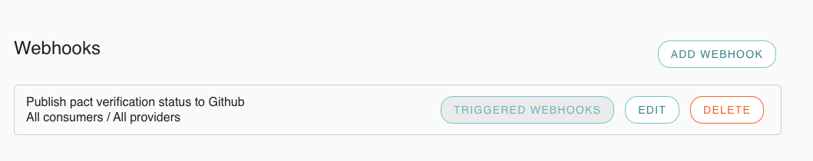
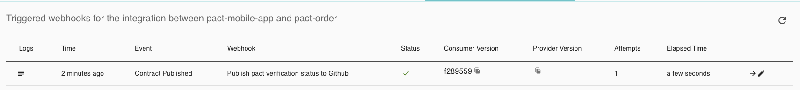
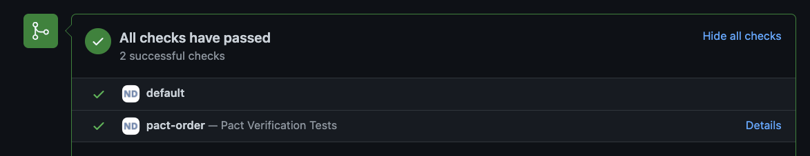

## Github status check:
Using pact webhooks we can add a status check to a PR that would stop it from being merged if the pact has not been verified (Assuming branch protection rules are turned on)
1. Generate a github api token with permissions `repo:status`
   https://github.com/settings/tokens -> Generate new token -> name: PACT

2. Create webhook using the pact-cli:
   This is a global webhook, it will apply to ALL consumer and providers.
```
pact-broker create-webhook \
  'https://api.github.com/repos/nathandeamer/${pactbroker.consumerName}/statuses/${pactbroker.consumerVersionNumber}' \
  -X POST \
  -H "Content-Type: application/json" \
  -d '{ "state": "${pactbroker.githubVerificationStatus}", "description": "Pact Verification Tests ${pactbroker.providerVersionTags}", "context": "${pactbroker.providerName}", "target_url": "${pactbroker.verificationResultUrl}" }' \
  --user nathandeamer:$GITHUB_TOKEN \
  --description "Publish pact verification status to Github" \
  --contract-published \
  --provider-verification-published
 ```



When a new consumer version is published you will see in the logs something like:
```
Events detected: contract_published (pact content is the same as previous version with tag nd/github-status and no new tags were applied)
Webhook "Publish pact verification status to Github" triggered for event contract_published.
  View logs at https://nathandeamer.pactflow.io/triggered-webhooks/xxxxxxxx/logs
```

You will also be able to see the webhook trigger in [pactflow](https://nathandeamer.pactflow.io/webhooks/provider/pact-order/consumer/pact-mobile-app)


### Pending:
The pact will show as pending until the provider tests have verified the pact  


### Success:
When the provider has verified the pact, a 'Provider verification published' event will be triggered  


The status check will have now show success:  


### Failure:
If the provider is not meeting the contract then it will show as a failure:    
