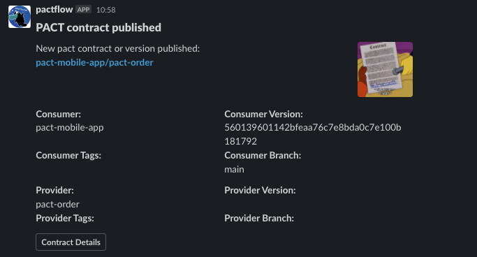
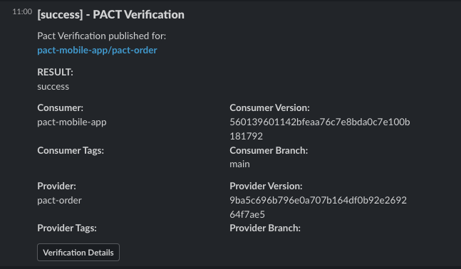

## Slack

## Incoming-Webhooks
Create a new emoji in slack for `:pactflow:`

### New contract published:
```
pact-broker create-webhook \
  'https://hooks.slack.com/services/[WEBBHOOK ID] \
  -X POST \
  -H "Content-Type: application/json" \
  -d '{"icon_emoji":":pactflow:","username":"pactflow","blocks":[{"type":"header","text":{"type":"plain_text","text":"PACT contract published","emoji":true}},{"type":"section","text":{"type":"mrkdwn","text":"New pact contract or version published:\n*<${pactbroker.pactUrl}|${pactbroker.consumerName}/${pactbroker.providerName}>*"},"accessory":{"type":"image","image_url":"https://media.giphy.com/media/3orieWNnUuuFa0y1NK/giphy.gif","alt_text":"New Contract thumbnail"}},{"type":"section","fields":[{"type":"mrkdwn","text":"*Consumer:*\n${pactbroker.consumerName}"},{"type":"mrkdwn","text":"*Consumer Version:*\n${pactbroker.consumerVersionNumber}"},{"type":"mrkdwn","text":"*Consumer Tags:*\n${pactbroker.consumerVersionTags}"},{"type":"mrkdwn","text":"*Consumer Branch:*\n${pactbroker.consumerVersionBranch}"}]},{"type":"section","fields":[{"type":"mrkdwn","text":"*Provider:*\n${pactbroker.providerName}"},{"type":"mrkdwn","text":"*Provider Version:*\n${pactbroker.providerVersionNumber}"},{"type":"mrkdwn","text":"*Provider Tags:*\n${pactbroker.providerVersionTags}"},{"type":"mrkdwn","text":"*Provider Branch:*\n${pactbroker.providerVersionBranch}"}]},{"type":"actions","elements":[{"type":"button","text":{"type":"plain_text","emoji":true,"text":"Contract Details"},"url":"${pactbroker.pactUrl}"}]}]}' \
  --description "Slack - Contract Published" \
  --contract-published 
 ```  



<br />

### Provider Verification Published (Any status):
```
pact-broker create-webhook \
  'https://hooks.slack.com/services/[WEBBHOOK ID]' \
  -X POST \
  -H "Content-Type: application/json" \
  -d '{"icon_emoji":":pactflow:","username":"pactflow","blocks":[{"type":"header","text":{"type":"plain_text","text":"[${pactbroker.githubVerificationStatus}] - PACT Verification","emoji":true}},{"type":"section","text":{"type":"mrkdwn","text":"Pact Verification published for:\n*<${pactbroker.verificationResultUrl}| ${pactbroker.consumerName}/${pactbroker.providerName}>*"}},{"type":"section","fields":[{"type":"mrkdwn","text":"*RESULT:*\n${pactbroker.githubVerificationStatus}"}]},{"type":"section","fields":[{"type":"mrkdwn","text":"*Consumer:*\n${pactbroker.consumerName}"},{"type":"mrkdwn","text":"*Consumer Version:*\n${pactbroker.consumerVersionNumber}"},{"type":"mrkdwn","text":"*Consumer Tags:*\n${pactbroker.consumerVersionTags}"},{"type":"mrkdwn","text":"*Consumer Branch:*\n${pactbroker.consumerVersionBranch}"}]},{"type":"section","fields":[{"type":"mrkdwn","text":"*Provider:*\n${pactbroker.providerName}"},{"type":"mrkdwn","text":"*Provider Version:*\n${pactbroker.providerVersionNumber}"},{"type":"mrkdwn","text":"*Provider Tags:*\n${pactbroker.providerVersionTags}"},{"type":"mrkdwn","text":"*Provider Branch:*\n${pactbroker.providerVersionBranch}"}]},{"type":"actions","elements":[{"type":"button","text":{"type":"plain_text","emoji":true,"text":"Verification Details"},"url":"${pactbroker.verificationResultUrl}"}]}]}' \
  --description "Slack - Provider Verification Published (Any status)" \
  --provider-verification-published 
 ```



<br />

### Provider Verification Published (SUCCESS):
```
pact-broker create-webhook \
  'https://hooks.slack.com/services/[WEBBHOOK ID]' \
  -X POST \
  -H "Content-Type: application/json" \
  -d '{"icon_emoji":":pactflow:","username":"pactflow","blocks":[{"type":"header","text":{"type":"plain_text","text":"[SUCCESS] - PACT Verification","emoji":true}},{"type":"section","text":{"type":"mrkdwn","text":"Pact Verification published for:\n*<${pactbroker.verificationResultUrl}| ${pactbroker.consumerName}/${pactbroker.providerName}>*"},"accessory":{"type":"image","image_url":"https://media.giphy.com/media/xT5LMQ8rHYTDGFG07e/giphy.gif","alt_text":"SUCCESS thumbnail"}},{"type":"section","fields":[{"type":"mrkdwn","text":"*RESULT:*\n${pactbroker.githubVerificationStatus}"}]},{"type":"section","fields":[{"type":"mrkdwn","text":"*Consumer:*\n${pactbroker.consumerName}"},{"type":"mrkdwn","text":"*Consumer Version:*\n${pactbroker.consumerVersionNumber}"},{"type":"mrkdwn","text":"*Consumer Tags:*\n${pactbroker.consumerVersionTags}"},{"type":"mrkdwn","text":"*Consumer Branch:*\n${pactbroker.consumerVersionBranch}"}]},{"type":"section","fields":[{"type":"mrkdwn","text":"*Provider:*\n${pactbroker.providerName}"},{"type":"mrkdwn","text":"*Provider Version:*\n${pactbroker.providerVersionNumber}"},{"type":"mrkdwn","text":"*Provider Tags:*\n${pactbroker.providerVersionTags}"},{"type":"mrkdwn","text":"*Provider Branch:*\n${pactbroker.providerVersionBranch}"}]},{"type":"actions","elements":[{"type":"button","text":{"type":"plain_text","emoji":true,"text":"Verification Details"},"url":"${pactbroker.verificationResultUrl}"}]}]}' \
  --description "Slack - Provider Verification Published (SUCCESS)" \
  --provider-verification-succeeded
 ```  


<br />

### Provider Verification Published (FAILURE):
```
pact-broker create-webhook \
  'https://hooks.slack.com/services/[WEBBHOOK ID]' \
  -X POST \
  -H "Content-Type: application/json" \
  -d '{"icon_emoji":":pactflow:","username":"pactflow","blocks":[{"type":"header","text":{"type":"plain_text","text":"[FAILURE] - PACT Verification","emoji":true}},{"type":"section","text":{"type":"mrkdwn","text":"Pact Verification published for:\n*<${pactbroker.verificationResultUrl}| ${pactbroker.consumerName}/${pactbroker.providerName}>*"},"accessory":{"type":"image","image_url":"https://media.giphy.com/media/3oriffFY6J66Fkrjc4/giphy.gif","alt_text":"FAILURE thumbnail"}},{"type":"section","fields":[{"type":"mrkdwn","text":"*RESULT:*\n${pactbroker.githubVerificationStatus}"}]},{"type":"section","fields":[{"type":"mrkdwn","text":"*Consumer:*\n${pactbroker.consumerName}"},{"type":"mrkdwn","text":"*Consumer Version:*\n${pactbroker.consumerVersionNumber}"},{"type":"mrkdwn","text":"*Consumer Tags:*\n${pactbroker.consumerVersionTags}"},{"type":"mrkdwn","text":"*Consumer Branch:*\n${pactbroker.consumerVersionBranch}"}]},{"type":"section","fields":[{"type":"mrkdwn","text":"*Provider:*\n${pactbroker.providerName}"},{"type":"mrkdwn","text":"*Provider Version:*\n${pactbroker.providerVersionNumber}"},{"type":"mrkdwn","text":"*Provider Tags:*\n${pactbroker.providerVersionTags}"},{"type":"mrkdwn","text":"*Provider Branch:*\n${pactbroker.providerVersionBranch}"}]},{"type":"actions","elements":[{"type":"button","text":{"type":"plain_text","emoji":true,"text":"Verification Details"},"url":"${pactbroker.verificationResultUrl}"}]}]}' \
  --description "Slack - Provider Verification Published (FAILURE)" \
  --provider-verification-failed
 ```  


<br /> 

### VERIFICATION Required
```
pact-broker create-webhook \
  'https://hooks.slack.com/services/[WEBBHOOK ID]' \
  -X POST \
  -H "Content-Type: application/json" \
  -d '{"icon_emoji":":pactflow:","username":"pactflow","blocks":[{"type":"header","text":{"type":"plain_text","text":"[VERIFICATION REQUIRED] - PACT Verification","emoji":true}},{"type":"section","text":{"type":"mrkdwn","text":"Pact Verification required for:\n*<${pactbroker.pactUrl}| ${pactbroker.consumerName}/${pactbroker.providerName}>*"},"accessory":{"type":"image","image_url":"https://media.giphy.com/media/26BGIqWh2R1fi6JDa/giphy.gif","alt_text":"VERIFICATION thumbnail"}},{"type":"section","fields":[{"type":"mrkdwn","text":"*Consumer:*\n${pactbroker.consumerName}"},{"type":"mrkdwn","text":"*Consumer Version:*\n${pactbroker.consumerVersionNumber}"},{"type":"mrkdwn","text":"*Consumer Tags:*\n${pactbroker.consumerVersionTags}"},{"type":"mrkdwn","text":"*Consumer Branch:*\n${pactbroker.consumerVersionBranch}"}]},{"type":"section","fields":[{"type":"mrkdwn","text":"*Provider:*\n${pactbroker.providerName}"},{"type":"mrkdwn","text":"*Provider Version:*\n${pactbroker.providerVersionNumber}"},{"type":"mrkdwn","text":"*Provider Tags:*\n${pactbroker.providerVersionTags}"},{"type":"mrkdwn","text":"*Provider Branch:*\n${pactbroker.providerVersionBranch}"}]},{"type":"actions","elements":[{"type":"button","text":{"type":"plain_text","emoji":true,"text":"Contract Details"},"url":"${pactbroker.pactUrl}"}]}]}' \
  --description "Slack - VERIFICATION REQUIRED" \
  --contract-requiring-verification-published
 ```

